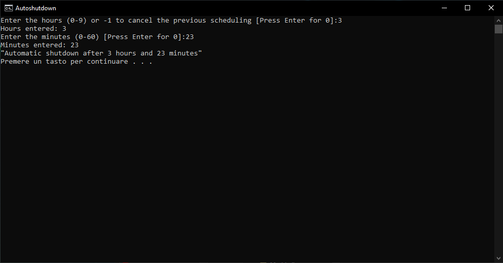

# Autoshutdown pc Windows 10/11
This batch script schedules an automatic shutdown of your Windows computer.

It prompts you to enter the shutdown time in hours (0-9) and minutes (0-60), converts this time to seconds, and executes the shutdown command.

